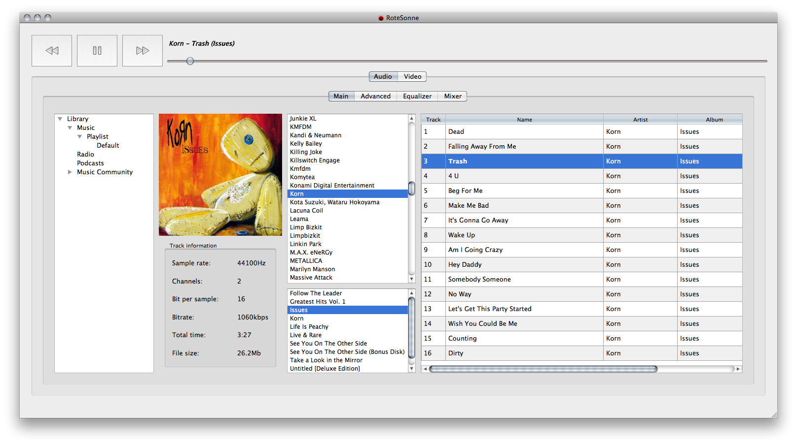

RoteSonne Player
================





INSTALL
________


```bash
$ git submodule update
$ git submodule init
$ sudo ln -s /path/to/silentmedia/src/libsml /usr/include
$ sudo ln -s /path/to/silentmedia/libsml.so /usr/lib
$ sudo ldconfig
```


Build:


```bash
$ make clean
$ qmake
$ make
```

After, you should run application (rotesonne binary file), refer to "Settings" -> "Collection" or just press
Ctrl + C, enter path to your library and press "Scan".

This will scan your audio library and refresh playlist view.

NOTE: RoteSonne (SilentMedia) works only with the following formats: "wav", "ogg", "flac", "wv".
